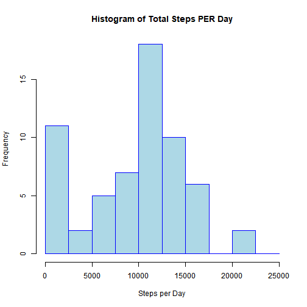

# COURSE PROJECT


## Loading and preprocessing the data

```r
library(dplyr)
library(ggplot2)
activity<-read.csv("activity.csv")
activity<-tbl_df(activity)
```
## QUESTION 1

## What is mean and median total number of steps taken per day?


```r
a1<-group_by(activity,date)
sum_steps<-summarize(a1,TotalSteps=sum(steps,na.rm = TRUE))
```

```
## `summarise()` ungrouping output (override with `.groups` argument)
```

```r
sum_steps$date<-as.Date(sum_steps$date)
hist(sum_steps$TotalSteps,col='light blue',border = "blue",main="Histogram of Total Steps PER Day",xlab="Steps per Day",breaks=seq(0,25000,by=2500))
```



```r
mean<-mean(sum_steps$TotalSteps)
median<-median(sum_steps$TotalSteps)
```

The mean of total number of steps is **9354.2295082**     
The median of total number of steps is **10395**      

## QUESTION 2

## What is the average daily activity pattern?


```r
a1<-group_by(activity,interval)
a1<-mutate(a1,AvgSteps=mean(steps,na.rm = TRUE))
g<-ggplot(data=a1,aes(interval,AvgSteps))
g+geom_line(col="maroon")+xlab("5-Minute-Interval")+ylab("Average Steps")+ggtitle("Average Steps PER Interval Across All Days")
```


```r
maxSteps<-a1[a1$AvgSteps==max(a1$AvgSteps),]
max<-unique(maxSteps$interval)
```

The **835 minute interval** on average across all the days in the dataset, contains the maximum number of steps      

## QUESTION 3
## Imputing missing values


```r
sum<-sum(!complete.cases(a1$steps))
```
The total number of rows with missing values is **2304**


```r
defaultW<-getOption("warn")
options(warn=-1)

a1<-group_by(activity,interval)
a1<-mutate(a1,AvgSteps=mean(steps,na.rm = TRUE))

missingdata<-a1[is.na(a1$steps),]
for (i in missingdata$steps){
       if(is.na(missingdata$steps==TRUE)){
              missingdata$steps=missingdata$AvgSteps}}
non_missingdata<-a1[!is.na(a1$steps),]
finalData<-rbind(missingdata,non_missingdata)
finalData<-group_by(finalData,date)
finalData$date<-as.Date(finalData$date)
finalData1<-mutate(finalData,TotalSteps_Day=sum(steps))
hist(finalData1$TotalSteps_Day,breaks=seq(0,25000,by=2500),col="green",border = "dark blue",main="Total number of steps taken each day",xlab="Total Steps per Day")
```


```r
mean2<-mean(finalData1$TotalSteps_Day)
median2<-median(finalData1$TotalSteps_Day)
options(warn = defaultW)
```

The mean of total number of steps taken per day is **1.0766189 &times; 10<sup>4</sup>**    
The median of total number of steps taken per day is **1.0766189 &times; 10<sup>4</sup>**
The values of mean and median differ from the first part of the assessment

## QUESTION 4

## Are there differences in activity patterns between weekdays and weekends?


```r
  weekData<-mutate(finalData1,Week=1)
weekData$Week<-sapply(weekData$date,function(x){
   if(weekdays(x)=="Saturday" | weekdays(x)=="Sunday")
     {y="Weekend"}else{y="Weekday"}
   y})
f1<-filter(weekData,Week=="Weekend")
f1<-select(f1,-AvgSteps)
f1<-group_by(f1,interval)
f1<-mutate(f1,Avgstep=mean(steps))
f2<-filter(weekData,Week=="Weekday")
f2<-select(f2,-AvgSteps)
f2<-group_by(f2,interval)
f2<-mutate(f2,Avgstep=mean(steps))
week_final<-rbind(f1,f2)
g<-ggplot(week_final,aes(interval,Avgstep))
g+geom_line(aes(col=Week))+facet_grid(Week~.)+ylab("Average no of steps")+ggtitle("Average no of steps by day type")
```


